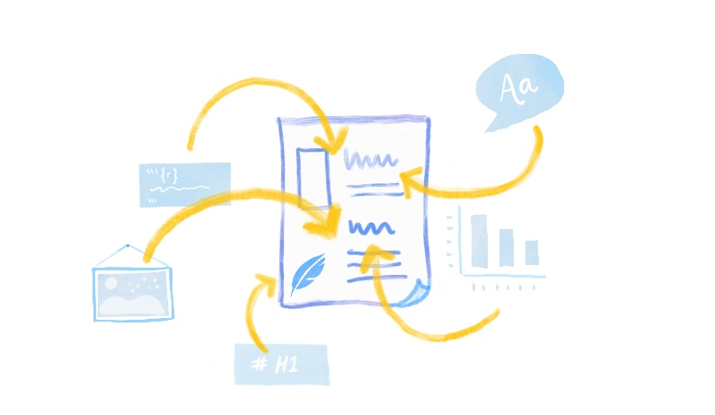
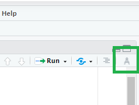

```{r setup, include=FALSE}
options(htmltools.dir.version = FALSE)
episode_counter <- 0
knitr::opts_chunk$set(
  collapse = TRUE,   
  comment = "#>"
)
```

```{r packages, include=FALSE}
library(countdown)
library(ymlthis)
library(tidyverse)
library(bakeoff)
library(xaringanExtra)

xaringanExtra::use_clipboard()
xaringanExtra::use_share_again() # need to get the slide button on html view
```

class: title-slide, center, middle

<span class="fa-stack fa-4x">
  <i class="fa fa-circle fa-stack-2x" style="color: #ffffffcc;"></i>
  <strong class="fa-stack-1x" style="color:#e7553c;">`r rmarkdown::metadata$session`</strong>
</span> 

# `r rmarkdown::metadata$title`

## `r rmarkdown::metadata$subtitle`

### `r rmarkdown::metadata$author` 

#### [`r params$site_link`](`r params$site_link`)


---
class: middle, center

| Time          | Activity                                                      |
|:--------------|:--------------------------------------------------------------|
| 09:30 - 11:00 | Session 1 (R Markdown Basics)                                 |
| 11:00 - 11:30 | *Break* `r emo::ji("coffee")`                                 |
| 11:30 - 13:00 | Session 2 (Advanced R Markdown)                               |
| 13:00 - 14:00 | *Lunch* `r emo::ji("bento")`                                  |
| 14:00 - 15:30 | Session 3 (Templates)                                         |
| 15:30 - 16:00 | *Break* `r emo::ji("tea")`                                    |
| 16:00 - 16:30 | Session 4 (Collections)                                       |

---
layout: true

<div class="my-footer"><span>`r params$site_link`</span></div>

---

```{r child="what-is-rmd.Rmd"}

```

---

.left-column[
<span class="fa-stack fa-4x">
  <i class="fa fa-circle fa-stack-2x" style="color: #f2e255"></i>
  <strong class="fa-stack-1x" style="color: #fff;">?</strong>
</span> 
]

.right-column[

# What is R Markdown?

1. ["An authoring framework for data science."](https://rmarkdown.rstudio.com/lesson-1.html) (`r emo::ji("heavy_check_mark")`)

1. [A document format (`.Rmd`).](https://bookdown.org/yihui/rmarkdown/) (`r emo::ji("heavy_check_mark")`)

1. [An R package named `rmarkdown`.](https://rmarkdown.rstudio.com/docs/) (`r emo::ji("heavy_check_mark")`)

1. ["A file format for making dynamic documents with R."](https://rmarkdown.rstudio.com/articles_intro.html) (`r emo::ji("heavy_check_mark")`)

1. ["A tool for integrating text, code, and results."](https://r4ds.had.co.nz/communicate-intro.html) (`r emo::ji("heavy_check_mark")`)

1. ["A computational document."](http://radar.oreilly.com/2011/07/wolframs-computational-documen.html) (`r emo::ji("heavy_check_mark")`)

1. Wizardry. (`r emo::ji("wizard")`)

]

---

.left-column[

# <i class="fab fa-github"></i>

]

.right-column[

# Go here:

[`r params$github_link`](`r params$github_link`)

Click on "Use this template" (make sure you are logged in)

```{r echo=FALSE}
knitr::include_graphics("images/cloud-from-template.png")
```

]

---

.left-column[

# <i class="fab fa-github"></i>

]

.right-column[

# In your repo

Click on green button, then the clipboard to copy HTTPS

```{r echo=FALSE}
knitr::include_graphics("images/cloud-from-https.png")
```
]

---

.left-column[

# <i class="fas fa-cloud"></i>

]

.right-column[

# Go to rstudio.cloud:

[`r params$cloud_link`](`r params$cloud_link`)

1. Join space > Click on "Projects" (nothing there)

1. New Project from GitHub Repo

1. Use **your** HTTPS link:


  ```{r echo=FALSE, out.width='50%'}
  knitr::include_graphics("images/cloud-from-git.png")
  ```

1. Name your project

]

---

.left-column[

# <i class="fas fa-cloud"></i>

]

.right-column[

# Install packages

```{r eval=FALSE}
install.packages(c("tidyverse", "rmarkdown", "here", 
                   "glue", "usethis", "wesanderson"))
```

]

???
When the rmds are opened RStudio will say along the top if there are any references
to packages that haven't been installed but the next slide includes a package that 
isn't in the code {usethis}

---

.left-column[

# <i class="fas fa-cloud"></i>

]

.right-column[

# Connect to GitHub

Still in rstudio.cloud:

```{r eval=FALSE}
library(usethis)
use_git_config(
  scope = "project",
  user.name = "Jane",
  user.email = "jane@example.org"
)
```

]

---
class: your-turn

# Your turn

Time to look at `01-bakeoff-report.Rmd`. 
Look at the source, then `r emo::ji("yarn")` **Knit** to HTML.

Try to identify these parts in the source and the output:

1. The **metadata**

1. The **text** 

1. The **code**

1. The **output**

**If this was easy**, try to find all code that produces a *plot*.


```{r echo = FALSE}
countdown(minutes = 5)
```

---
class: live-code

# Basic anatomy I

We look at the *source* anatomy for `01-bakeoff-report.Rmd` together:

1. The **metadata**

1. The **text** 

1. The **code**
    

???
Point out the parts in the Rmd script. For further documentation on metadata
https://rmarkdown.rstudio.com/docs/reference/rmd_metadata.html
    
---

class: live-code

# Basic anatomy II

We look at the *output* anatomy for `01-bakeoff-report.Rmd` together:

1. The **metadata**

1. The **text** 

1. The **code**

1. The **output**


---
background-image: url(images/rmarkdown_wizards.png)
background-size: contain

.footnote[Art by [Allison Horst](https://twitter.com/allison_horst?lang=en)]

---
class: middle, center

# What is inside in more detail?



---
class: middle, center, inverse

<span class="fa-stack fa-4x">
  <i class="fa fa-circle fa-stack-2x" style="color: #fff;"></i>
  <strong class="fa-stack-1x" style="color:#17a2b8;">`r (episode_counter <- episode_counter + 1)` </strong>
</span> 

--

# Metadata

---

# metadata: YAML

.pull-left[

_"YAML Ain't Markup Language"_

```yaml
---
key: value
---
```

]

.pull-right[

```{r echo=FALSE, out.width="75%", fig.align='center'}
knitr::include_graphics("images/orchestra.jpg")
```

]

???

Using the {ymlthis} this section renders the "look" of the YAML with the three 
dashes then key: value which is the format used in YAML. 

---
class: middle, center

# Output options

---

# Save output options in your YAML

.pull-left[

```{r echo = FALSE}
yml_empty() %>% 
  yml_title("The Great British Bake Off") %>% 
  yml_output(html_document()) %>% 
  asis_yaml_output()
```

```{r echo = FALSE}
yml_empty() %>% 
  yml_title("The Great British Bake Off") %>% 
  yml_output(html_document(toc = TRUE)) %>%  
  asis_yaml_output()
```


]

.pull-right[

```{r echo=FALSE, out.width="75%", fig.align='center'}
knitr::include_graphics("images/orchestra.jpg")
```

]

---
class: your-turn

# Your turn

## Add output options to YAML

Use `?html_document` from your R console to find the code to:

1. Add a floating table of contents

1. Add a theme

`r emo::ji("yarn")` **Knit** to HTML to see the output.

**If this was easy**, try to embed the `Rmd` source code to download.

_psst...answers on the next slide..._

```{r echo = FALSE}
countdown(minutes = 3)
```

---
class: your-turn

# Answers

```{r echo = FALSE}
yml_empty() %>% 
  yml_title("The Great British Bake Off") %>% 
  yml_output(html_document(toc = TRUE,
                           toc_float = TRUE,
                           theme = "flatly",
                           code_download = TRUE)) %>% 
  asis_yaml_output()
```

---

# Parameters

```{r echo = FALSE}
yml_empty() %>% 
  yml_title("The Great British Bake Off") %>% 
  yml_output(html_document(toc = TRUE,
                           toc_float = TRUE,
                           theme = "flatly",
                           code_download = TRUE)) %>% 
  yml_params(
    series = '1'
  ) %>% 
  asis_yaml_output()
```

???

Some may be familiar to the concept of parameters from SQL where code use in multiple
places later in the script are written at the top so they can be easily changed. 

This is a particular example of this 'hard coding' of parameters.

---
class: your-turn

# Your turn

.pull-left[

Change this:

```{r echo = FALSE}
yml_empty() %>% 
  yml_title("The Great British Bake Off") %>% 
  yml_output(html_document(toc = TRUE,
                           toc_float = TRUE,
                           theme = "flatly",
                           code_download = TRUE)) %>% 
  yml_params(
    series = '1'
  ) %>% 
  asis_yaml_output()
```

]

.pull-right[

To this:

```{r echo = FALSE}
yml_empty() %>% 
  yml_title("The Great British Bake Off") %>% 
  yml_output(html_document(toc = TRUE,
                           toc_float = TRUE,
                           theme = "flatly",
                           code_download = TRUE)) %>% 
  yml_params(
    series = '2'
  ) %>% 
  asis_yaml_output()
```

]

Now click on knit button and pick __"Knit with Parameters."__ How is this different from what you did above?


```{r echo = FALSE}
countdown(minutes = 3)
```

---
class: inverse, center, middle

<span class="fa-stack fa-4x">
  <i class="fa fa-circle fa-stack-2x" style="color: #fff;"></i>
  <strong class="fa-stack-1x" style="color:#17a2b8;">`r (episode_counter <- episode_counter + 1)` </strong>
</span> 

--

# Text

---

# <center>Headers</center>

--

.pull-left[
```markdown
# HEADER 1

## HEADER 2

### HEADER 3

#### HEADER 4

##### HEADER 5

###### HEADER 6
```
]

???
Make sure that there is a space between the hashes and the text as it won't be picked up otherwise.

--

.pull-right[
# HEADER 1

## HEADER 2

### HEADER 3

#### HEADER 4

##### HEADER 5

###### HEADER 6
]

---
class: middle, center


```{r echo=FALSE, out.width='80%'}
knitr::include_graphics("images/rmd-nav.png")
```

???
Navigate chunks by using the menu in RStudio. Chunks will work without names but
will have default names like Chunk 1, Chunk 2 and so on.

---

# <center>Text</center>

--

.pull-left[
```markdown
 **The Great British Bake Off** 
(often abbreviated to _Bake Off_ or _GBBO_) 
is a British television baking competition.
```
]

--

.pull-right[

**The Great British Bake Off** 
(often abbreviated to _Bake Off_ or _GBBO_) 
is a British television baking competition. 

]

???

Using markdown language we format text as bold or italics. 

---
class: middle, center

# <center>Visual Markdown Editing</center>

--



???

As of [RStudio version 1.4](https://www.rstudio.com/blog/rstudio-v1-4-preview-visual-markdown-editing/)
there is now Visual Markdown Editing, located in the Editor pane (when an RMarkdown script is open)

---
class: middle, center

# <center>Default to Visual Editor</center>

--


---
class: top

# <center>Lists</center>

--

.pull-left[

```markdown
The original cast included:

- Sue Perkins (_host_)
- Mel Giedroyc (_host_)
- Mary Berry (_judge_) and
- Paul Hollywood (_judge_).

In each episode, the amateur bakers are 
given **three challenges** based on that 
week's theme.

1. a signature bake,
1. a technical challenge,
1. a show-stopper.
```

]

--

.pull-right[

The original cast included:

- Sue Perkins (_host_)
- Mel Giedroyc (_host_)
- Mary Berry (_judge_) and
- Paul Hollywood (_judge_).

In each episode, the amateur bakers are 
given **three challenges** based on that 
week's theme.

1. a signature bake,
1. a technical challenge,
1. a show-stopper.

]

---

# <center>Images</center>

--

.pull-left[
```markdown
Competitive baking, such as making Victoria 
sponge (_pictured_), is part of the classic 
English village fête,
which inspired the series.

```
]

--

.pull-right[
Competitive baking, such as making Victoria 
sponge (_pictured_), is part of the classic 
English village fête,
which inspired the series.

]

???

A simple markdown code line for linking to an image online. html can be used
too which can be useful if you need to resize the pictures.

---

# <center>Images - html</center>

--

.pull-left[
```markdown
Competitive baking, such as making Victoria 
sponge (_pictured_), is part of the classic 
English village fête,
which inspired the series.
<div id="bg">
  
</div> 
```
]

--

.pull-right[
Competitive baking, such as making Victoria 
sponge (_pictured_), is part of the classic 
English village fête,
which inspired the series.
<div id="bg">
  
</div> 
]

???
html can be used too 

---

# <center>Alt Text</center>

--

.pull-left[
When images break, they still make sense
]

--

.pull-right[
Competitive baking, such as making Victoria 
sponge (_pictured_), is part of the classic 
English village fête,
which inspired the series.

]


???
Alternative text is useful for people who use screen readers but also helpful 
for when the image link breaks, you now get a description of what you should be 
seeing.

---

# <center>Links</center>

--

.pull-left[
```markdown
Competitive baking, such as making Victoria 
sponge (_pictured_), is part of the classic 
English village fête,
which inspired the series.

[Photo](https://en.wikipedia.org/wiki/Philosophy)


```
]

--

.pull-right[
Competitive baking, such as making Victoria 
sponge (_pictured_), is part of the classic 
English village fête,
which inspired the series.

[Photo](https://en.wikipedia.org/wiki/Philosophy)


]

---

# <center>Links - html</center>

--

.pull-left[
```markdown
Competitive baking, such as making Victoria 
sponge (_pictured_), is part of the classic 
English village fête,
which inspired the series.
  <a href="https://en.wikipedia.org/wiki/Philosophy">
  
```
]

--

.pull-right[
Competitive baking, such as making Victoria 
sponge (_pictured_), is part of the classic 
English village fête,
which inspired the series.
  <a href="https://en.wikipedia.org/wiki/Philosophy">
  
]

???
A good site for more information on html is [W3schools](https://www.w3schools.com/html/html_images.asp)


---

name: 03-formative
class: middle

# Quiz

--

.pull-left[

How do you add headers in Markdown?

`! Header`

`- Header`

`# Header`

`1. Header`

]

--

.pull-right[

What about lists? Bulleted? Numbered?

`! Item 1`

`- Item 1`

`# Item 1`

`1. Item 1`

]

---
class: inverse, center, middle

<span class="fa-stack fa-4x">
  <i class="fa fa-circle fa-stack-2x" style="color: #fff;"></i>
  <strong class="fa-stack-1x" style="color:#17a2b8;">`r (episode_counter <- episode_counter + 1)` </strong>
</span> 

--

# <i class="fab fa-r-project"></i> code

---

# Code chunks

.pull-left[

````
```{r}`r ''`
ratings %>% 
  filter(series == 1) %>% 
  top_n(1, viewers_7day)
```
````

What is the fate of this chunk?

]

--

.pull-right[

```{r}
ratings %>% 
  filter(series == 1) %>% 
  top_n(1, viewers_7day)
```

]

???

This is a view of the data that would normally go to the Console so includes information
like data types.

Copy and paste into the `01-bakeoff-report.Rmd` and knit to see it in the report.

---

# Code chunks

.pull-left[

````
```{r}`r ''`
top_viewers <- ratings %>% 
  filter(series == 1) %>% 
  top_n(1, viewers_7day)
```
````

What fate do you predict here?

]

--

.pull-right[

```{r}
top_viewers <- ratings %>% 
  filter(series == 1) %>% 
  top_n(1, viewers_7day)
```
]

???

Not quite what we expect as this is just the code showing, not the results, which
is the main aim of RMarkdown. 

---

# Code chunks

.pull-left[

````
```{r}`r ''`
top_viewers <- ratings %>% 
  filter(series == 1) %>% 
  top_n(1, viewers_7day)
  
top_viewers
```
````

]

???
Adding the object name to run - will that show the results?

--

.pull-right[

```{r}
top_viewers <- ratings %>% 
  filter(series == 1) %>% 
  top_n(1, viewers_7day)

top_viewers
```

]

???
Yes, but with the data column types again.

---

# Code chunks

.pull-left[

```{r include = FALSE}
viewers <- ratings %>% 
  filter(series == 1) %>% 
  select(series:viewers_28day) %>% 
  pivot_longer(starts_with("viewers"), 
    names_to = "days", 
    names_prefix = "viewers_", 
    values_to = "viewers"
  ) 
```


````
```{r}`r ''`
ggplot(viewers, aes(episode, viewers, 
                    colour = days, 
                    group = days)) + 
  geom_point() + 
  geom_line() + 
  labs(x = "Episode", 
       y = "Viewers (millions)") +
  expand_limits(y = 0) 
```
````

What about this one?

]

--

.pull-right[

```{r fig.retina=3, out.width="60%", fig.align='center'}
ggplot(viewers, aes(episode, viewers, 
                    colour = days, 
                    group = days)) + 
  geom_point() + 
  geom_line() + 
  labs(x = "Episode", 
       y = "Viewers (millions)") +
  expand_limits(y = 0) 
```

]

---
class: live-code

# Adding/running chunks

Together we:

1. Add chunks with button or:

   Ctrl + Alt + `i` (Windows/Linux)
   
   Command (or Cmd) `⌘` + Option (or Alt) `⌥` +  `i` (Mac)
   
1. Run chunks by:

   Run current chunk button (interactive)
   
   Knit button / run all chunks

???

Shortcut key to run a chunk Ctrl + Shift + Enter

Shortcuts for chunks can be amended or added in Tools/Modify Keyboard Shortcuts...

---

# Inline code

.pull-left[

The top viewed episode in series 1 was episode
``` `r knitr::inline_expr('top_viewers %>% pull(episode)')` ```

]

???
Combining code with text.

--

.pull-right[

The top viewed episode in series 1 was episode
`r top_viewers %>% pull(episode)`

]

---
class: inverse, center, middle

<span class="fa-stack fa-4x">
  <i class="fa fa-circle fa-stack-2x" style="color: #fff;"></i>
  <strong class="fa-stack-1x" style="color:#17a2b8;">`r (episode_counter <- episode_counter + 1)` </strong>
</span> 

--

# Controlling Output

---

# Chunk options

.pull-left[

````
```{r}`r ''`
glimpse(ratings)
```
````

]

.pull-right[

```{r}
glimpse(ratings)
```

]

???
Just a plain r means that R code runs. Chunks can also be SQL - requires SQL connections.

---

# echo

.pull-left[

````
```{r echo=FALSE}`r ''`
glimpse(ratings)
```
````

]

.pull-right[

```{r echo=FALSE}
glimpse(ratings)
```

]

???
Echo (showing code) is default to TRUE. Setting to FALSE just returns the results, no code.

---

# eval

.pull-left[

````
```{r eval=FALSE}`r ''`
glimpse(ratings)
```
````

]

.pull-right[

```{r eval=FALSE}
glimpse(ratings)
```

]

???
Eval is short for evaluate and if set to FALSE stops the code from running. 
Good if the code is an example of broken code which would stop the report from 
running if set to TRUE (which is default).

---

# include

.pull-left[

````
```{r include=FALSE}`r ''`
glimpse(ratings)
```
````

]

.pull-right[

```{r include=FALSE}
glimpse(ratings)
```

]

???

[From RStudio lesson](https://rmarkdown.rstudio.com/lesson-3.html):

FALSE prevents code and results from appearing in the finished file. 
R Markdown still runs the code in the chunk, and the results can be used by other chunks.

---

# results

.pull-left[

````
```{r echo=TRUE, results='hide'}`r ''`
glimpse(ratings)
```
````

]

.pull-right[

```{r echo=TRUE, results='hide'}
glimpse(ratings)
```

]

???

Note here the code has more than one control and they are separated by a comma.

[From RMarkdown tips](https://garthtarr.github.io/meatR/tips.html):

results = 'hide' hide the results of the chunk output (i.e. don’t show them)
results = 'hold' hold the results of the chunk output until all commands in the 
chunk have been run

[On 'asis'](https://garrettgman.github.io/rmarkdown/authoring_rcodechunks.html)
Note the use of the results='asis' chunk option. This is required to ensure that
the raw table output isn’t processed further by knitr. The kable function 
includes several options to control the maximum number of digits for numeric 
columns, alignment, etc (refer to the knitr package documentation for additional
details)
---

# message / warning


???

This is an example of a detailed message from {tidyverse} but what if you wanted 
to not print that message when a chunk was run?

---

# message / warning

.pull-left[

````
```{r message=FALSE, warning=FALSE}`r ''`
library(tidyverse)
```
````

]

.pull-right[

```{r message=FALSE, warning=FALSE}
library(tidyverse)
```

]

---

# Chunk option take-aways

+ Place between curly braces<br>`{r option=value}`

+ Multiple options separated by commas<br>`{r option1=value, option2=value}`

+ Careful! The `r` part is the **code engine** (other engines possible)

???

Such as sql which will require a database connection. Training and exercises available
through the NHS-R Community, [link here](https://philosopher-analyst.netlify.app/intro-r/nhsr-intro/11-sql-connection/)

---

# Chunk labels

.pull-left[

````
```{r peek, echo=FALSE, results='hide'}`r ''`
glimpse(ratings)
```
````

]

.pull-right[

+ Place between curly braces<br>`{r label}`

+ Separated options with commas<br>`{r label, option1=value}`

+ Careful! No duplicate chunk labels

    ````
    ```{r peek}`r ''`
    head(ratings)
    ```
    ````

    ```
    Error in parse_block(g[-1], g[1], params.src) : 
      duplicate label 'peek'
    Calls: <Anonymous> ... process_file -> split_file -> lapply -> FUN -> parse_block
    Execution halted
    ```

]

???

Live code example with the peek chunk, knit then repeat the chunk either by copying
or using Ctrl + Alt + i for a new chunk and then typing head(ratings)

---

class: middle, center

# A good chunk label

.pull-left[

### Good

`my-plot`

`myplot`

`myplot1`

`myplot-1`

`MY-PLOT`

]

.pull-right[

### Bad

`my_plot`

`my plot`

everything else!

]

---

# The setup chunk


.pull-left[

````
```{r setup, include=FALSE}`r ''`
knitr::opts_chunk$set(
  collapse = TRUE,   
  comment = "#>", 
  out.width = "100%" 
)
```
````

]

.pull-right[

+ A special chunk label: `setup`

+ Typically #1

+ All following chunks will use these options (i.e., sets global chunk options)

+ **Tip**: set `include=FALSE`

+ You can (and should) use individual chunk options too

]

---
class: live-code

# Adding a setup chunk

We do this together:

1. Add `fig.path = "figs/"` as a knitr code chunk option for a single plot (watch what happens if we don't include the backslash!)

1. Knit and behold


???
Copy the fig.path = "figs/" and paste into the chunk settings for the first chart.
When this is run there is noticeably change to the report but a folder appears, called
figs and in there is `unnamed-chunk-2-1.png`.

If fig.path = "figs" is used instead the chart is not saved into a folder but in the main
area and the name is a concatenation of figs and the default `figsunnamed-chunk-2-1.png`

---
class: your-turn

# Your turn

Customize this report.

1. Label the code chunks with plots.

1. Add your setup chunk. 

1. Use the RStudio outline pane; rejoice!

1. Build a [graphical user interface](https://bookdown.org/yihui/rmarkdown/params-knit.html#the-interactive-user-interface) for parameters. 

__If this was easy,__ try adding a parameter for color palette and add in a package like [wesanderson](https://github.com/karthik/wesanderson) &mdash; use the parameter in our ggplot2 code.

_psst...`01-bakeoff-report-alison.Rmd` is there..._

_psst-psst...answers on the next slide..._

```{r echo = FALSE}
countdown(minutes = 5)
```

---
class: your-turn

# Answers

````
```{r setup, include=FALSE}`r ''`
knitr::opts_chunk$set(echo = FALSE, 
                      warning = FALSE,
                      message = FALSE,
                      fig.path = "alison-figs/")
```
````

```yaml
params:
  series:
    label: "Series:"
    value: 1
    input: numeric
    min: 1
    max: 9
    step: 1
  palette: 
    label: "Wes Anderson palette:"
    value: GrandBudapest1
    input: select
    choices: [GrandBudapest1, Darjeeling1, Darjeeling2, FantasticFox1, Royal2]
```


---

class: middle, center

# Take-aways

--

`r emo::ji("heavy_check_mark")` **Document your document:** use YAML to control the metadata

--

`r emo::ji("heavy_check_mark")` **Style your document:** use YAML to set the output format

--

`r emo::ji("heavy_check_mark")` **Organise your text:** use markdown headers with `#`

--

`r emo::ji("heavy_check_mark")` **Organise your code:** use `knitr` chunk labels

--

`r emo::ji("heavy_check_mark")` **Style your text:** use markdown **bold**, _italics_, <i class="fas fa-list-ul"></i> bullets, and <i class="fas fa-list-ol"></i> lists

--

`r emo::ji("heavy_check_mark")` **Style your output:** use `knitr` chunk options

--

`r emo::ji("yarn")` early, `r emo::ji("yarn")` often


---
class: middle, center

# `r emo::ji("stopwatch")`

# Time for a break!

```{r echo = FALSE}
countdown(minutes = 30, update_every = 15)
```

---

background-position: top center
background-size: 100%
class: middle, center

Original authors

### Alison Hill  
[<i class="fab fa-github"></i> @apreshill](https://github.com/apreshill)  
[<i class="fab fa-twitter"></i> @apreshill](https://twitter.com/apreshill)

### Emi Tanaka  
[<i class="fab fa-github"></i> @emitanaka](https://github.com/emitanaka)  
[<i class="fab fa-twitter"></i> @statsgen](https://twitter.com/statsgen)


.footnote[All content is CC-BY. All art (unless otherwise noted) is by [Desirée De Leon](https://desiree.rbind.io/), CC-BY-NC-ND.]
