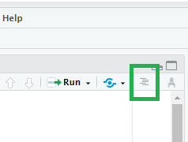
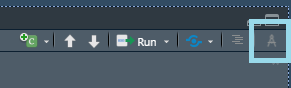
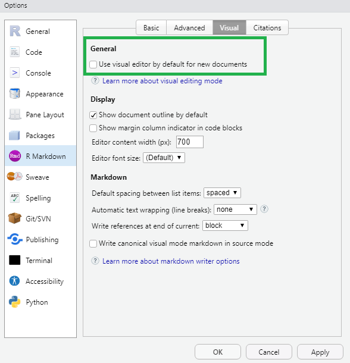

```{r setup, include=FALSE}
options(htmltools.dir.version = FALSE)
episode_counter <- 0
knitr::opts_chunk$set(
  collapse = TRUE,   
  comment = "#>"
)
```

```{r packages, include=FALSE}
library(countdown)
library(ymlthis)
library(tidyverse)
library(bakeoff)
library(xaringanExtra)

xaringanExtra::use_clipboard()
xaringanExtra::use_share_again() # need to get the slide button on html view
```

class: title-slide, center, middle

<span class="fa-stack fa-4x">
  <i class="fa fa-circle fa-stack-2x" style="color: #ffffffcc;"></i>
  <strong class="fa-stack-1x" style="color:#e7553c;">`r rmarkdown::metadata$session`</strong>
</span> 

# `r rmarkdown::metadata$title`

---
class: inverse, center, middle

# <center>Headers</center>

<span class="fa-stack fa-4x">
  <i class="fa fa-circle fa-stack-2x" style="color: #fff;"></i>
  <strong class="fa-stack-1x" style="color:#17a2b8;">`r (episode_counter <- episode_counter + 1)` </strong>
</span> 

???

Text is in Markdown code - people might be familiar with note taking apps that use
Markdown. Allows for formatting of text to be through code.

---

# <center>Headers</center>

.pull-left[
```markdown
# HEADER 1

## HEADER 2

### HEADER 3

#### HEADER 4

##### HEADER 5

###### HEADER 6
```
]

???
Make sure that there is a space between the hashes and the text as it won't be picked up otherwise.

--

.pull-right[
# HEADER 1

## HEADER 2

### HEADER 3

#### HEADER 4

##### HEADER 5

###### HEADER 6
]

---

class: middle, center

# <center>Navigating headers</center>

--

```{r echo=FALSE}

```

???
Navigate headers by using the document outline button in RStudio. 

---
class: inverse, center, middle

# <center>Formatting Text</center>

<span class="fa-stack fa-4x">
  <i class="fa fa-circle fa-stack-2x" style="color: #fff;"></i>
  <strong class="fa-stack-1x" style="color:#17a2b8;">`r (episode_counter <- episode_counter + 1)` </strong>
</span> 

---
# <center>Formatting Text</center>

--

.pull-left[
```markdown
 **The Great British Bake Off** 
(often abbreviated to _Bake Off_ or _GBBO_) 
is a British television baking competition.
```
]

--

.pull-right[

**The Great British Bake Off** 
(often abbreviated to _Bake Off_ or _GBBO_) 
is a British television baking competition. 

]

???

Using markdown language we format text as bold or italics. 

---
class: inverse, center, middle

# <center>Visual Markdown Editing</center>

<span class="fa-stack fa-4x">
  <i class="fa fa-circle fa-stack-2x" style="color: #fff;"></i>
  <strong class="fa-stack-1x" style="color:#17a2b8;">`r (episode_counter <- episode_counter + 1)` </strong>
</span> 

---
class: middle, center

# <center>Visual Markdown Editing</center>



???

As of [RStudio version 1.4](https://www.rstudio.com/blog/rstudio-v1-4-preview-visual-markdown-editing/)
there is now Visual Markdown Editing, located in the Editor pane (when an RMarkdown script is open)

---
class: middle, center

# <center>Default to Visual Editor</center>



---
class: inverse, center, middle

# <center>Lists</center>

<span class="fa-stack fa-4x">
  <i class="fa fa-circle fa-stack-2x" style="color: #fff;"></i>
  <strong class="fa-stack-1x" style="color:#17a2b8;">`r (episode_counter <- episode_counter + 1)` </strong>
</span> 

---

class: top

# <center>Lists</center>

.pull-left[

```markdown
The original cast included:

- Sue Perkins (_host_)
- Mel Giedroyc (_host_)
- Mary Berry (_judge_) and
- Paul Hollywood (_judge_).

In each episode, the amateur bakers are 
given **three challenges** based on that 
week's theme.

1. a signature bake,
1. a technical challenge,
1. a show-stopper.

```

]

--

.pull-right[

The original cast included:

- Sue Perkins (_host_)
- Mel Giedroyc (_host_)
- Mary Berry (_judge_) and
- Paul Hollywood (_judge_).

In each episode, the amateur bakers are 
given **three challenges** based on that 
week's theme.

1. a signature bake,
1. a technical challenge,
1. a show-stopper.

]

???
The introduction to R training uses the code (@) but this doesn't work necessarily in {xaringan} slides.

---

class: inverse, center, middle

# <center>Hyperlinks</center>

<span class="fa-stack fa-4x">
  <i class="fa fa-circle fa-stack-2x" style="color: #fff;"></i>
  <strong class="fa-stack-1x" style="color:#17a2b8;">`r (episode_counter <- episode_counter + 1)` </strong>
</span> 

---
# <center>Hyperlink</center>

.pull-left[
 
## Rounded brackets ()

```markdown
The link to the [course material](https://philosopher-analyst.netlify.app/rmd-workshop/)
```

## No brackets []

```markdown
The link to the course material https://philosopher-analyst.netlify.app/rmd-workshop/
```
]

--

.pull-right[
The link to the [course material](https://philosopher-analyst.netlify.app/rmd-workshop/)


The link to the course material https://philosopher-analyst.netlify.app/rmd-workshop/
]

---
class: inverse

# <center>Next section...</center>

