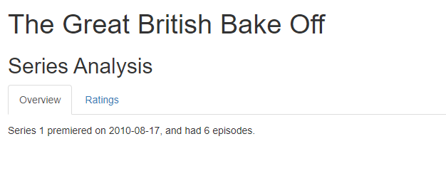
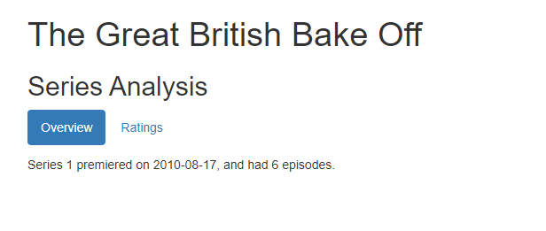

```{r setup, include=FALSE}
options(htmltools.dir.version = FALSE)
episode_counter <- 0
knitr::opts_chunk$set(
  collapse = TRUE,   
  comment = "#>"
)
```

```{r packages, include=FALSE}
library(countdown)
library(ymlthis)
library(tidyverse)
library(bakeoff)
library(xaringanExtra)

xaringanExtra::use_clipboard()
xaringanExtra::use_share_again() # need to get the slide button on html view
```

class: title-slide, center, middle

<span class="fa-stack fa-4x">
  <i class="fa fa-circle fa-stack-2x" style="color: #ffffffcc;"></i>
  <strong class="fa-stack-1x" style="color:#e7553c;">`r rmarkdown::metadata$session`</strong>
</span> 

# `r rmarkdown::metadata$title`

---
class: inverse, center, middle

# <center>Tabs</center>

<span class="fa-stack fa-4x">
  <i class="fa fa-circle fa-stack-2x" style="color: #fff;"></i>
  <strong class="fa-stack-1x" style="color:#17a2b8;">`r (episode_counter <- episode_counter + 1)` </strong>
</span> 

---

# <center>Dealing with long reports</center>

--

.pull-left[

```markdown

## Series Analyss {.tabset}

### Overview

### Ratings

```
]

--

.pull-right[



]

???
A Return space/carriage is required between the tabs OR two spaces after the line.

Note to start a tabset there have to be 2 hashes and not the main header of one #


---
class: your-turn

# Your turn

Looking at `01-bakeoff-report.Rmd` together. 
Look at the source, then `r emo::ji("yarn")` **Knit**.

1. Add a header `# Series Analysis`, then `r emo::ji("yarn")` **Knit**.

1. Change `# Overview` to `### Overview {.tabset}`, then `r emo::ji("yarn")` **Knit**.

1. Change `# Ratings` to `### Ratings`, then `r emo::ji("yarn")` **Knit**.

1. Remove the space in the second header `###Ratings`, then `r emo::ji("yarn")` **Knit**. What happens?


```{r echo = FALSE}
countdown(minutes = 5)
```

---
class: inverse, center, middle

# <center>Styling Tabs</center>

<span class="fa-stack fa-4x">
  <i class="fa fa-circle fa-stack-2x" style="color: #fff;"></i>
  <strong class="fa-stack-1x" style="color:#17a2b8;">`r (episode_counter <- episode_counter + 1)` </strong>
</span> 

---

# <center>Styling Tabs</center>

.pull-left[

```markdown

## Series Analysis {.tabset, .tabset-fade}

### Overview

### Ratings

```
]

--

.pull-right[



]

---
class: inverse, center, middle

# <center>Dynamic tabs</center>

<span class="fa-stack fa-4x">
  <i class="fa fa-circle fa-stack-2x" style="color: #fff;"></i>
  <strong class="fa-stack-1x" style="color:#17a2b8;">`r (episode_counter <- episode_counter + 1)` </strong>
</span> 

---
class: live-code

# Dynamic tabs

1. Add a new header `## Days {.tabset .tabset-pill}`

1. <kbd>Ctrl + Alt + i</kbd> for a new R chunk.

1. Add the `results='asis'` in the chunk options.

1. Create a list of days 

```markdown 
viewers %>% select(days) %>% unique() %>% pull()
```

1. Copy loop code and add the code where it says <copy the chart code here>:

```markdown
for(i in days){ 
  
  cat("###", i, '<br>', '\n')
  
  data <- viewers %>% 
    filter(days == i) 
  
  chart <- <copy the chart code here>
  
  print(chart)
  
  cat('\n', '<br>', '\n\n')
  
}
```

???
As with so much in R most things can be automated. If you were to require many tabs to be created for teams/wards/hospitals then automating this using a loop can be useful. First example shared in the [NHS-R Community demos and how tos](https://github.com/nhs-r-community/demos-and-how-tos/blob/main/rmarkdown/loop_tabs/loop_tabs.Rmd)
