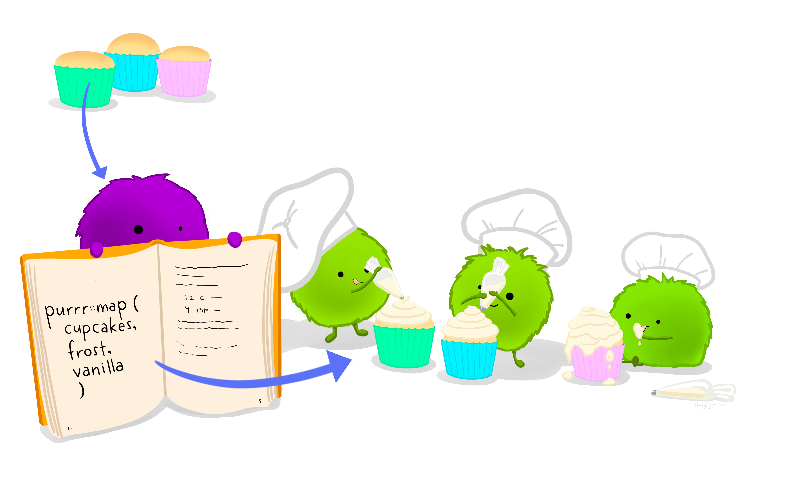

```{r setup, include=FALSE}
options(htmltools.dir.version = FALSE)
episode_counter <- 0
knitr::opts_chunk$set(
  collapse = TRUE,   
  comment = "#>"
)
```

```{r packages, include=FALSE}
library(countdown)
library(ymlthis)
library(tidyverse)
library(bakeoff)
library(xaringanExtra)

xaringanExtra::use_clipboard()
xaringanExtra::use_share_again() # need to get the slide button on html view
```

class: title-slide, center, middle

<span class="fa-stack fa-4x">
  <i class="fa fa-circle fa-stack-2x" style="color: #ffffffcc;"></i>
  <strong class="fa-stack-1x" style="color:#e7553c;">`r rmarkdown::metadata$session`</strong>
</span> 

# `r rmarkdown::metadata$title`

---
class: inverse, center, middle

# <center>Command line</center>

<span class="fa-stack fa-4x">
  <i class="fa fa-circle fa-stack-2x" style="color: #fff;"></i>
  <strong class="fa-stack-1x" style="color:#17a2b8;">`r (episode_counter <- episode_counter + 1)` </strong>
</span> 

---
class: middle, center

# Rendering

.pull-left[

So far: `r emo::ji("yarn")`

]

.pull-right[
```{r eval=FALSE}
render("01-bakeoff-report.Rmd")
```

]
---
class: your-turn

# Your turn

Instead of using the "Knit" button, try running this code in your R console:

```{r eval = FALSE}
library(rmarkdown) # needs to be loaded first
render("01-bakeoff-report.Rmd")
```


Now try changing the parameters:

```{r eval = FALSE}
render("01-bakeoff-report.Rmd",
       params = list(series = "9"))
```

__If this was easy__, play with the other parameters too. Or see if you can change the output format, and add output options.

_psst...answers on the next slide..._


```{r echo = FALSE}
countdown(minutes = 5)
```

???
The rendered document doesn't appear in a pop up and you will have to click on the newly created `01-bakeoff-report.html` which corresponds to the `.rmd` file. 

A hint for the output_format is to select F1 when the cursor is in the function render. The help files will appear in the bottom right panel of RStudio.

---
class: your-turn

# Answer

```{r eval=FALSE}
render("01-bakeoff-report.Rmd",
       params = list(series = "9"), 
       output_format = distill::distill_article(toc = TRUE))
```


---
class: middle, center, inverse

<span class="fa-stack fa-4x">
  <i class="fa fa-circle fa-stack-2x" style="color: #fff;"></i>
  <strong class="fa-stack-1x" style="color:#17a2b8;">`r (episode_counter <- episode_counter + 1)` </strong>
</span> 

--

# Render loops


---
class: live-code

# We loop together


```{r eval=FALSE}
# the setup
series <- sort(unique(ratings$series))

# the loop
for (this_series in series) {
  render("02-bakeoff-finales.Rmd",
         params = list(series = this_series))
}
```

_psst...the wrong way_

---

```{r echo=FALSE, out.width="80%", fig.align="center"}
knitr::include_graphics("images/joy-of-fp/forloops.png")
```


---

# We need two things

For the `rmarkdown::render()` function to work they way we want:

1. The list of series -> `params`

1. The name of each report -> `output_file`

We could do this with a loop, but let's start **purrr**ing...

---
class: center, middle, inverse

> "Of course someone has to write **loops**. 

> It doesn't have to be _you_.

> &mdash; Jenny Bryan

---

```{r echo=FALSE, fig.align="center"}

```

---

```{r echo=FALSE, fig.align="center"}

```


---

# Rendering multiple reports

```{r loop-setup, eval=FALSE}
# the setup

paths <- paste0("series-", series)

# series needs to be a list
series <- sort(unique(ratings$series))
params <- map(series, ~ list(series = .x))
str(params)
```

```{r loop-walk, eval=FALSE}
walk2(
  paths, params,
  ~ rmarkdown::render("02-bakeoff-finales.Rmd", output_file = .x, params = .y)
)
```


---
class: your-turn

# Your turn

Try to get this set-up working locally for you.

```{r ref.label='loop-setup', eval=FALSE}
```

```{r ref.label='loop-walk', eval=FALSE}
```

```{r echo=FALSE}
countdown(minutes = 5)
```


---
class: live-code

# Digging deeper

So now the output file name changed, but we can go deeper.

Let's say we'd also like the change the title in our YAML.

Let's do this together.

(make sure the below is in quotes)

```{r echo = FALSE}
yml_empty() %>% 
  yml_title("The Great British Bake Off, Series `r params$series`") %>% 
  asis_yaml_output()
```

---
class: your-turn

# Your turn

Use your render script again and check to make sure that the titles now have the series number in them. 

It is good practice to save your rendering script in the project, call it `_render.R`.

```{r echo=FALSE}
countdown(minutes = 5)
```


---
class: middle, center

# `r emo::ji("bento")`

# Time for lunch!

```{r echo = FALSE}
countdown(minutes = 60, update_every = 15)
```

